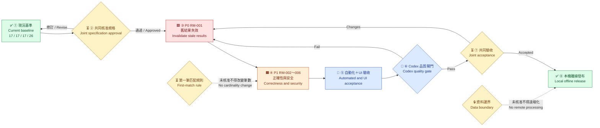
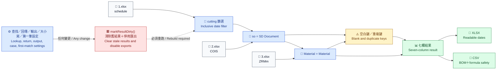
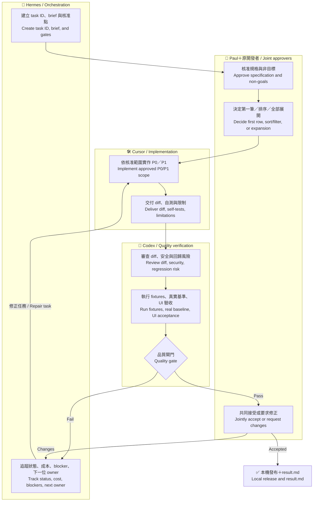
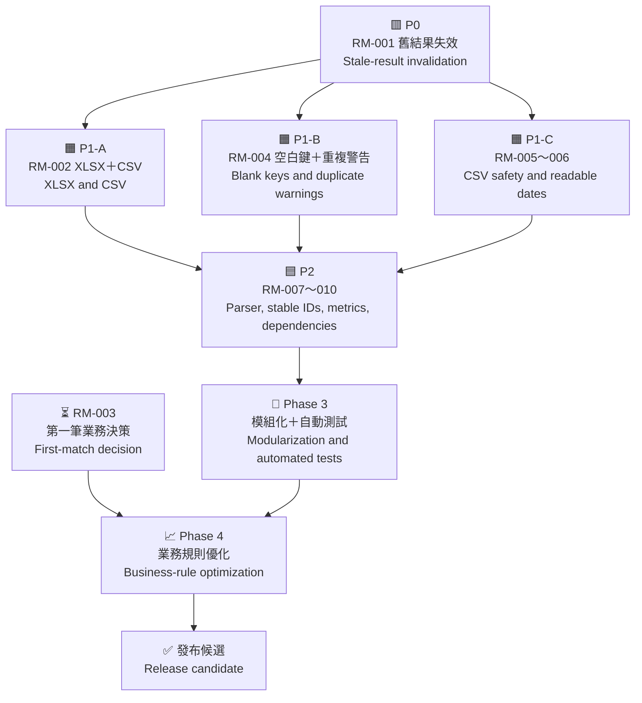
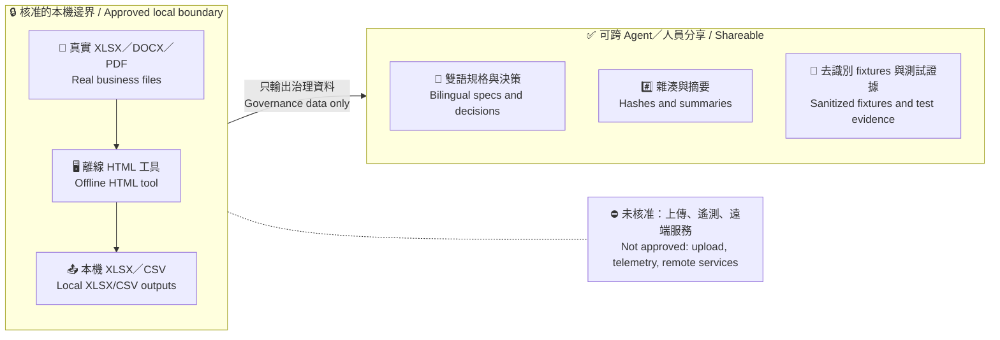

# RAW MAT 修正流程與架構圖

# RAW MAT Repair Flow and Architecture Diagrams

本文件將審查、修正優先序、角色、品質閘門與資料邊界轉成可快速閱讀的圖示。繁體中文在前，英文緊接；詳細規則仍以 docs/01 至 docs/04 為準。

This document turns the review, repair priorities, roles, quality gates, and data boundary into quick-reference diagrams. Traditional Chinese appears first, followed by English; docs/01 through docs/04 remain authoritative.

## 圖例 / Legend

| 圖示 | 中文 | English |
|---|---|---|
| ✅ | 已完成／通過 | Completed / passed |
| ⏳ | 等待人工決策 | Awaiting human decision |
| 🟥 | P0，最優先 | P0, highest priority |
| 🟧 | P1，正確性與安全 | P1, correctness and security |
| 🟦 | P2，可維護性 | P2, maintainability |
| 🔒 | 資料或發布閘門 | Data or release gate |
| 🔁 | 修正後重測 | Retest after repair |

目前位置：✅ 階段一文件完成；⏳ 等待 Paul 與原開發者共同核准；程式仍為 NEEDS WORK。

Current position: ✅ Phase 1 documentation is complete; ⏳ joint approval by Paul and the original developer is pending; the application remains NEEDS WORK.

## 1. 修正生命週期 / Repair lifecycle

中文重點：未共同核准，不改業務筆數規則；未通過品質閘門，不發布。

English key point: no business-cardinality change without joint approval, and no release without passing the quality gate.

## 2. 程式資料流與 P0 控制點 / Program data flow and P0 control point

中文重點：任何影響結果的設定一變動，舊結果與 XLSX／CSV／複製功能必須立即失效。

English key point: any result-affecting setting change must immediately invalidate the old result and XLSX/CSV/copy actions.

## 3. 跨 Agent／跨人員泳道 / Cross-agent and cross-person swimlane

中文重點：任何 Agent 都不得自行決定多筆匹配規則；每次交辦需保留 brief、plan、decisions、result、diff 與測試證據。

English key point: no agent may decide multi-match behavior independently; every handoff retains the brief, plan, decisions, result, diff, and test evidence.

## 4. 優先順序與相依關係 / Priority and dependency map

| 順序 / Order | 工作 / Work | 完成條件 / Completion condition |
|---|---|---|
| 1 | 🟥 RM-001 | 設定變更即清除結果並停用匯出 / Configuration changes clear results and disable exports |
| 2 | 🟧 RM-002、004、005、006 | 安全 XLSX／CSV、空白鍵不匹配、日期可讀 / Safe XLSX/CSV, no blank-key matches, readable dates |
| 3 | ⏳ RM-003 | Paul 與原開發者書面核准 / Written joint approval |
| 4 | 🟦 RM-007～010 | parser、穩定 ID、指標、依賴修正 / Parser, stable IDs, metrics, dependency fixes |
| 5 | 🧩 Phase 3 | 核心模組可獨立測試 / Core modules independently testable |
| 6 | 📈 Phase 4 | 核准業務規則與資料邊界後評估 / Evaluate only after rule and data-boundary approval |

## 5. 資料安全邊界 / Data security boundary

中文重點：真實業務檔案不進 Git、不跨 Agent、不由 Agent 修改；資料邊界核准前維持完全本機。

English key point: real business files do not enter Git, cross agent boundaries, or get modified by agents; processing remains fully local until data-boundary approval.

## 6. 實作備忘錄 / Implementation memo

- 目標 / Goal：把修正優先序、責任與閘門轉成單頁視覺架構 / Turn repair priorities, responsibilities, and gates into a one-page visual architecture.
- 範圍 / Scope：只新增文件；不修改 vlookup-web.html 或業務資料 / Documentation only; no change to vlookup-web.html or business data.
- 判斷 / Judgment：使用 Mermaid，方便 Git、Markdown viewer 與 handoff 直接維護 / Use Mermaid for direct maintenance in Git, Markdown viewers, and handoffs.
- 下一步 / Next：共同核准後另建 Phase 2 handoff，依第 4 節順序執行 / After joint approval, create the Phase 2 handoff and execute Section 4 in order.